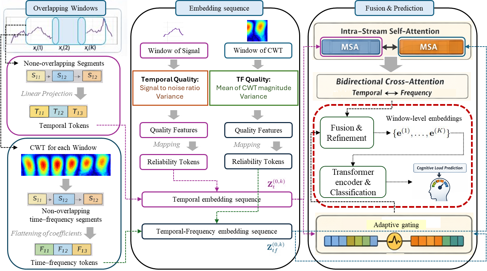

# TF-iPupil: Driver Cognitive Load Prediction using Temporal–Frequency Transformers

A lightweight transformer framework for predicting driver cognitive load from pupil signals using joint temporal and time–frequency modeling.

## Framework Overview

## Description

TF-iPupil is designed to predict driver cognitive load using pupil-based physiological signals.

Unlike traditional methods, it:
- Combines raw temporal pupil signals with time–frequency representations (CWT)
- Uses a dual-stream transformer architecture
- Performs block-level temporal–frequency fusion
- Introduces reliability-aware tokens to handle noisy or degraded signals

The model is robust to real-world challenges such as occlusion, illumination changes, and sensor noise.

## Results

- 95.62% accuracy on ADABase dataset
- 98.51% accuracy on Windsor dataset
- Robust performance under synthetic signal disturbances

